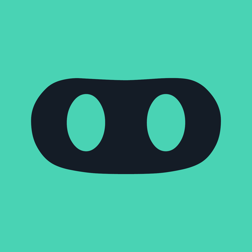

   
  <b>DevHub</b>: GitHub native client for Android, iOS & Web 
  with <b>95%+ code sharing</b> between them

## Why

If you have one or more repositories on GitHub that you work on or that you really like, the `watch` feature on GitHub is great to follow all their activities.
It's like Dan said:

The problem is that your notifications on GitHub may get **really** cluttered.
And I believe the notifications should be only for important things, like `@mentions` and issues `assigned to you`.

 

## Features

Current implementations:

- [x] **GitHub watcher**: Follow GitHub activity without needing to `watch` a repository neither `follow` the user
  - [x] **User feed**: See the exact content the user see on their home page
  - [x] **User events**: See all activity made by an user _(starred a repo, ...)_
  - [x] **Repository events**: See all activity happening on a single repo _(released a new version, ...)_
  - [x] **Organization events**: See all activity happening on the whole organization _(merged a pull request, ...)_
- [x] **Notifications manager**
  - [x] **TweetDeck column-style**: Overview all your notifications with easy
  - [x] **Mark as read/unread**: Differently than GitHub, the notification doesn't disappear after opening it

Other features:

- [x] **Inbox Zero**: Keep your mind clean by archiving all seem items
- [x] **Theme**: Light, Dark or Dark-Blue

Next features:

- [ ] **Notifications content**: See the relevant notification content before opening it
- [ ] **More complete GitHub client**: Native views for `Issues`, `Pull Requests`, `User Profiles`, etc
- [ ] **Push Notifications**

> Pull Requests more than welcome!

 

## Screenshots

### Android

  
  

### iOS

  
  

 

### Web

  

 

## Author

🇧🇷 Bruno Lemos, Remote Software Engineer 
🐦 Follow me on Twitter ([@brunolemos](https://twitter.com/brunolemos))

 

## Inspired by

Similar projects:

- [DevSpace](https://devspace.io/) by [@zenorocha](https://github.com/zenorocha)
- [Octobox](https://github.com/octobox/octobox) by [@andrew](https://github.com/andrew)

 

## License

Copyright (c) 2017 [Bruno Lemos](https://twitter.com/brunolemos), licensed under the AGPL-3.0 license.

> ✅ This project is 100% free to use and provided  as is without any warranties.
You are encouraged to use, share and submit pull requests with improvements.

> ⚠️ If you create a fork or project based on it, is must also be free, open source, under the same license and give credits to this repository and author.

> 🚫 You are not allowed to distribute this application anywhere, including but not limited to Apple Store, Google Play or any web hosts.

See [LICENSE.md](LICENSE.md) for a super long, detailed and serious information.
