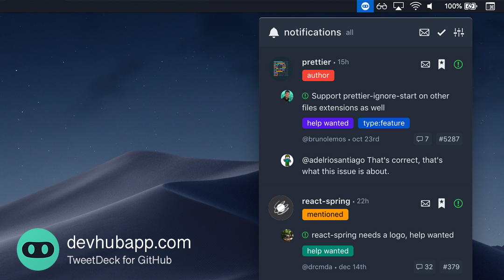

<p align="center">
  <br/>
  <span><b>DevHub</b>: <span>GitHub Notifications Manager & Activity Watcher</span><br/>
  <span><a href="https://play.google.com/store/apps/details?id=com.devhubapp&utm_source=github_repo_link" target="_blank">Android</a>, <a href="https://itunes.apple.com/us/app/devhub-for-github/id1191864199?l=en&mt=8&utm_source=github_repo_link" target="_blank">iOS</a>, <a href="https://devhubapp.com/" target="_blank">Web</a> & <a href="https://github.com/devhubapp/devhub/releases" target="_self">Desktop</a> with <b>95%+ code sharing</b> between them<br/><i>thanks to React Native + React Native Web</i></span><br/>
  <p align="center">
    <a href="https://itunes.apple.com/us/app/devhub-for-github/id1191864199?l=en&mt=8&utm_source=github_repo_button" target="_blank"></a>
    <a href="https://play.google.com/store/apps/details?id=com.devhubapp&utm_source=github_repo_button" target="_blank"></a>
  </p>
</p>


## Why

DevHub is a **mobile and desktop** app to help you **manage GitHub Notifications** and stay on top of **repository activities**. Save **custom searches**, apply **filters** and don't miss anything important.

<br/>

## Screenshots

### Desktop

#### Multi-column view


#### Single-column view


#### Menubar



### Mobile

<p align="center">
  
  
  
</p>

<br/>

## Download links

- Web: [devhubapp.com](https://devhubapp.com/)
- Android: [Play Store](https://play.google.com/store/apps/details?id=com.devhubapp&utm_source=github_repo_link)
- iOS: [App Store](https://itunes.apple.com/us/app/devhub-for-github/id1191864199?l=en&mt=8&utm_source=github_repo_link)
- Desktop:
  - [GitHub Releases](https://github.com/devhubapp/devhub/releases) (macOS, Windows, Linux)
  - Homebrew (macOS alternative):
    ```
      brew tap devhubapp/devhub
      brew cask install devhub
    ```

<br/>


## Features

- [x] **Multi-column layout**: See at a quick glance everything that is going on (like TweetDeck!);
- [x] **Single-column layout**: Do focused work, a single task at a time;
- [x] **Filters**: Apply different filters to each column, save your custom searches to make your life easier;
- [x] **Inbox Zero**: Clear all the seen items and gain peace of mind;
- [x] **Notifications manager**: See all the relevant information before opening the notification, like comment content, issue/pull request status, release description, etc.;
- [x] **Repository watcher**: Keep up to date with repositories' activities without using the `watch` feature so your notifications don't get cluttered;
- [x] **User stalking**: Follow user activities without using the `follow` button; see activities that GitHub doesn't show on your feed, like their issue comments and pushed commits;
- [x] **Home/Dashboard**: See yours or other users' home screen (a.k.a. GitHub Dashboard), a great way to discover interesting repositories;
- [x] **Save for later**: Save any activity or notification for later, so you don't forget to get back to them;
- [x] **Keyboard shortcuts**: Do anything using only the keyboard ([see shortcuts below](#keyboard-shortcuts));
- [x] **Theme support**: Choose between 6 light or dark themes; Automatically toggle on day/night switch;
- [x] **And more!**: Desktop apps, native mobile apps, open source, modern tech stack, ...

<br/>

### Next features:

- [ ] **Issues/PR management**: Manage all issues and PRs, filter the ones related to you, take actions, etc. ([vote: #110](https://github.com/devhubapp/devhub/issues/110));
- [ ] **Trending**: New column type to show Trending repositories ([vote: #48](https://github.com/devhubapp/devhub/issues/48));
- [ ] **Push notifications**: Enable push notifications for your filtered columns on mobile and/or desktop ([vote: #51](https://github.com/devhubapp/devhub/issues/51));
- [ ] **Drag & Drop**: Allow moving columns using drag&drop ([vote: #42](https://github.com/devhubapp/devhub/issues/42))
- [ ] **GitHub Enterprise**: Support for self hosted GitHubs on local networks (vote: [#165](https://github.com/devhubapp/devhub/issues/165))

> Which one do you want first? Any other recommendations? Search for [existing feature requests](https://github.com/devhubapp/devhub/issues?q=is%3Aissue+is%3Aopen+label%3A%22feature+request%22+sort%3Areactions-%2B1-desc) and add a 👍 reaction on them, or create a new one. Feel free to ping me (@brunolemos) if you feel it's something important.

<!--
#### About paid features

##### What features will be paid?

- Support for private repositories
- Support for GitHub Enterprise
- Push notifications
- Unlimited number of columns
- Unlimited history of notifications and activities
  > GitHub API only returns notifications from the last 7 days and at max 300 activities; the paid feature will allow you to have access to all the data from the past by saving them on DevHub's database

##### Why is this app not completely free?

> "If you find something you think is cool then give that person some money for it so they can make more things you think are cool" 💙

DevHub plans to be a sustainable open source project. It's not made by a huge company like Facebook, it is made by a single developer that could be making $200k+ on Facebook, but instead makes $0 working on this full time. If you want the project to live and be actively maintained, understand that it will need a revenue and consider donating or subscribing to the paid plan once it launches.

> [Join the discussion](https://github.com/devhubapp/devhub/issues/106)!
-->

<br/>

## Backers

Thank you to all our backers! 🙏 [[Become a backer](https://opencollective.com/devhub#backer)]

<a href="https://opencollective.com/devhub#backers" target="_blank"></a>

## Sponsors

Support this project by becoming a sponsor. Your logo will show up here with a link to your website. [[Become a sponsor](https://opencollective.com/devhub#sponsor)]

<a href="https://opencollective.com/devhub/sponsor/0/website" target="_blank"></a>
<a href="https://opencollective.com/devhub/sponsor/1/website" target="_blank"></a>
<a href="https://opencollective.com/devhub/sponsor/2/website" target="_blank"></a>
<a href="https://opencollective.com/devhub/sponsor/3/website" target="_blank"></a>
<a href="https://opencollective.com/devhub/sponsor/4/website" target="_blank"></a>
<a href="https://opencollective.com/devhub/sponsor/5/website" target="_blank"></a>
<a href="https://opencollective.com/devhub/sponsor/6/website" target="_blank"></a>
<a href="https://opencollective.com/devhub/sponsor/7/website" target="_blank"></a>
<a href="https://opencollective.com/devhub/sponsor/8/website" target="_blank"></a>
<a href="https://opencollective.com/devhub/sponsor/9/website" target="_blank"></a>


## Donate

- [DevHub - OpenCollective](https://opencollective.com/devhub)
- [DevHub - Crypto](https://commerce.coinbase.com/checkout/49be60bc-5bc0-45a9-9438-a1eabc81fe53)
- [@brunolemos - Patreon](https://www.patreon.com/brunolemos)
- [@brunolemos - Crypto](https://commerce.coinbase.com/checkout/f314f3d3-2310-43ad-a2d0-c0c6462e792c)

<br/>

## Tech Stack

- [TypeScript](https://github.com/Microsoft/TypeScript)
- [Create React App](https://github.com/facebook/create-react-app)
- [Yarn Workspaces](https://yarnpkg.com/lang/en/docs/workspaces/) _(Monorepo)_
- [React](https://github.com/facebook/react) _(100% [Hooks](https://reactjs.org/docs/hooks-intro.html), zero classes)_
- [React Native](https://github.com/facebook/react-native)
- [React Native Web](https://github.com/necolas/react-native-web)
- [Redux](https://github.com/reduxjs/react-redux)
- [Redux Persist](https://github.com/rt2zz/redux-persist)
- [Redux Saga](https://github.com/redux-saga/redux-saga/)
- [Reselect](https://github.com/reduxjs/reselect)
- [GraphQL](https://github.com/facebook/graphql)


<br/>

## Contributing

See [CONTRIBUTING.md](./CONTRIBUTING.md)

<br/>
<br/>


## Keyboard shortcuts

| Key       | Action                           | Implemented    | By      |
| --------- | -------------------------------- | -------------- | ------- |
| `Esc`     | Close currently open modal       | ✅             | [@brunolemos](https://github.com/brunolemos) |
| `Esc`     | Exit full screen mode on desktop | ✅             | [@brunolemos](https://github.com/brunolemos) |
| `Esc`     | Unselect currently selected item | ✅             | [@brunolemos](https://github.com/brunolemos) |
| `n`       | Add a new column                 | ✅             | [@brunolemos](https://github.com/brunolemos) |
| `p`       | Open preferences                 | ✅             | [@brunolemos](https://github.com/brunolemos) |
| `1`...`9` | Go to the `nth` column           | ✅             | [@brunolemos](https://github.com/brunolemos) |
| `0`       | Go to the last column            | ✅             | [@brunolemos](https://github.com/brunolemos) |
| `Arrow`, `j`, `k` | Move down/up inside a column     | ✅             | [@thefrontendwizard](https://github.com/thefrontendwizard) |
| `Arrow`, `h`, `l` | Move left/right between columns  | ✅             | [@thefrontendwizard](https://github.com/thefrontendwizard) |
| `r`       | Mark item as read/unread         | ✅             | [@brunolemos](https://github.com/brunolemos) |
| `s`       | Toggle save item for later       | ✅             | [@brunolemos](https://github.com/brunolemos) |
| `Alt` + `Arrow` | Move currently selected column | ✅             | [@brunolemos](https://github.com/brunolemos) |
| `Tab`     | Navigate between buttons and links   | ✅             | [@brunolemos](https://github.com/brunolemos) |
| `?`       | Show keyboard shortcuts          | ✅             | [@brunolemos](https://github.com/brunolemos) |

> **Tip:** To scroll horizontally on devices without horizontal scrolling (e.g. on Windows), hold `Shift` and scroll vertically

<br/>
<br/>


## Community

<div>
 
Twitter: <a href="https://twitter.com/devhub_app">@devhub_app</a>
<br/>

 
Slack: <a href="https://slack.devhubapp.com/">Slack Invitation</a>
</div>

<br/>

## Author

Follow me on Twitter: [@brunolemos](https://twitter.com/brunolemos)
<br/>Donate to me: [Patreon](https://www.patreon.com/brunolemos) | [Crypto](https://commerce.coinbase.com/checkout/f314f3d3-2310-43ad-a2d0-c0c6462e792c)
<br/>Donate to DevHub: [OpenCollective](https://opencollective.com/devhub) | [Crypto](https://commerce.coinbase.com/checkout/49be60bc-5bc0-45a9-9438-a1eabc81fe53)

<a href="https://twitter.com/brunolemos" target="_blank"></a>

<br/>

## License

Copyright (c) 2019 Bruno Lemos.

This project is provided as is without any warranties. Use at your own risk.<br/>
By using DevHub you agree with its [privacy](PRIVACY.md) policy and [license](LICENSE.md).
