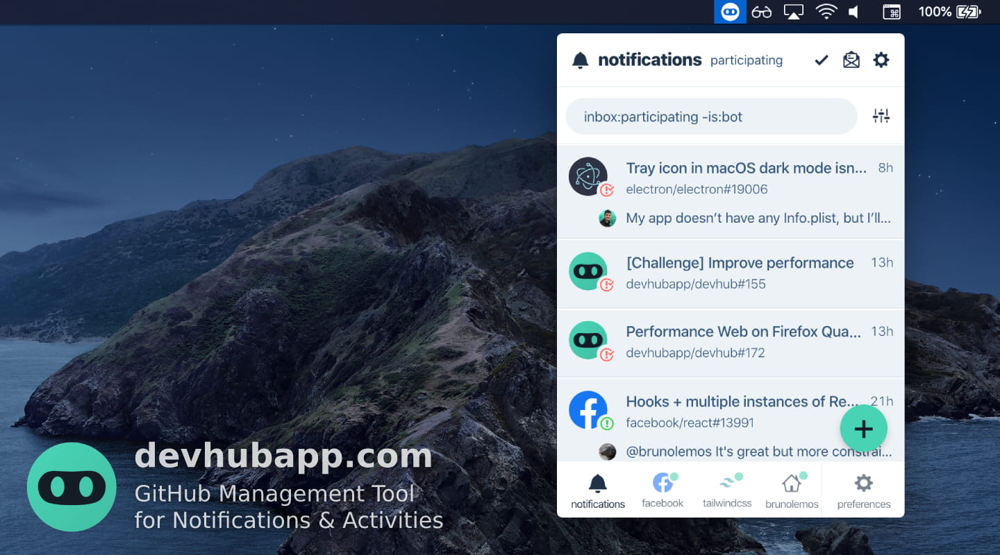
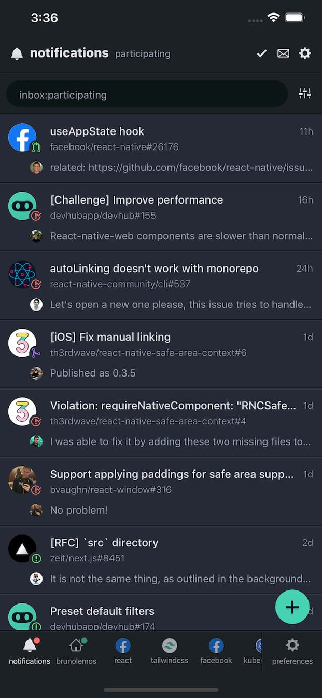
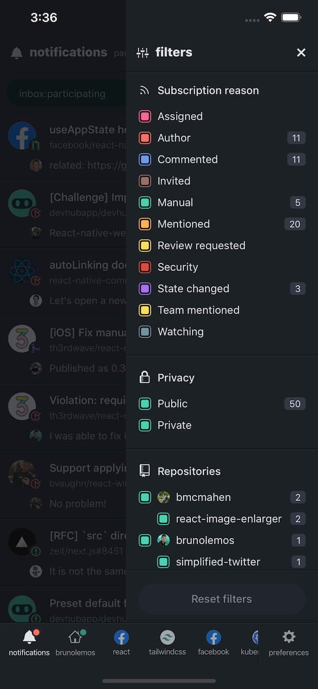
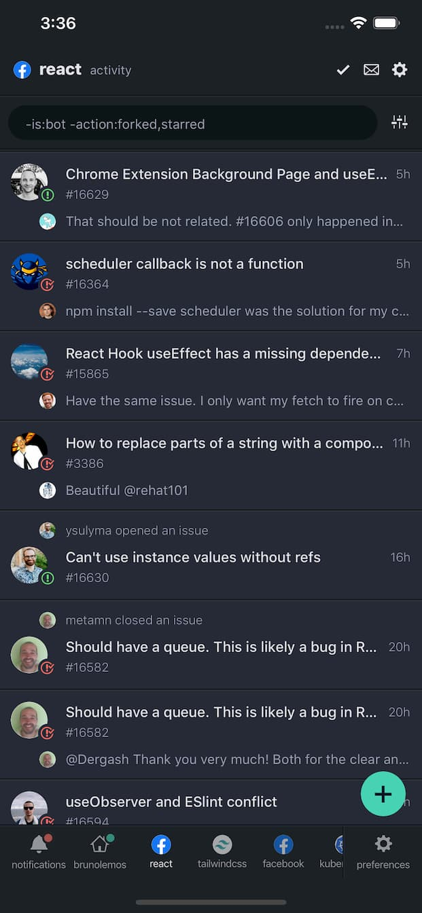

<p align="center">
  <br/>
  <span><b>DevHub</b>: <span>GitHub Notifications & Activities on your Desktop</span><br/>
  <span><a href="https://play.google.com/store/apps/details?id=com.devhubapp&utm_source=github_repo_link" target="_blank">Android</a>, <a href="https://itunes.apple.com/us/app/devhub-for-github/id1191864199?l=en&mt=8&utm_source=github_repo_link" target="_blank">iOS</a>, <a href="https://devhubapp.com/" target="_blank">Web</a> & <a href="https://github.com/devhubapp/devhub/releases" target="_self">Desktop</a> with <b>95%+ code sharing</b> between them<br/><i>thanks to React Native + React Native Web</i></span><br/>
  <p align="center">
    <a href="https://itunes.apple.com/us/app/devhub-for-github/id1191864199?l=en&mt=8&utm_source=github_repo_button" target="_blank"></a>
    <a href="https://play.google.com/store/apps/details?id=com.devhubapp&utm_source=github_repo_button" target="_blank"></a>
  </p>
</p>


## Why

DevHub is a **mobile and desktop** app to help you **manage GitHub Notifications** and stay on top of **repository activities**. Save **custom searches**, apply **filters** and don't miss anything important.

<br/>

## Screenshots

### Desktop

)


#### Menubar



### Mobile

<p align="center">
  
  
  
</p>

<br/>

## Download links

- Web: [devhubapp.com](https://devhubapp.com/)
- Android: [Play Store](https://play.google.com/store/apps/details?id=com.devhubapp&utm_source=github_repo_link)
- iOS: [App Store](https://itunes.apple.com/us/app/devhub-for-github/id1191864199?l=en&mt=8&utm_source=github_repo_link)
- Desktop:
  - [GitHub Releases](https://github.com/devhubapp/devhub/releases) (macOS, Windows, Linux)
  - Homebrew (macOS alternative):
    ```
      brew tap devhubapp/devhub
      brew install --cask devhub
    ```

<br/>


## Features

- [x] **Multi-column layout**: See at a quick glance everything that is going on (like TweetDeck!);
- [x] **Filters**: Apply different filters to each column, save your custom searches to make your life easier;
- [x] **Inbox Zero**: Mark columns as done and gain peace of mind;
- [x] **Notifications manager**: See all the relevant information before opening the notification, like comment content, issue/pull request status, release description, etc.;
- [x] **Repository watcher**: Keep up to date with repositories' activities without using the `watch` feature so your notifications don't get cluttered;
- [x] **User stalking**: Follow user activities without using the `follow` button; see activities that GitHub doesn't show on your feed, like their issue comments and pushed commits;
- [x] **Home/Dashboard**: See yours or other users' home screen (a.k.a. GitHub Dashboard), a great way to discover interesting repositories;
- [x] **Save for later**: Save any activity or notification for later, so you don't forget to get back to them;
- [x] **Keyboard shortcuts**: Do anything using only the keyboard (press Shift+? in the web or desktop app to see all available shortcuts);
- [x] **Theme support**: Choose between 6 light or dark themes; Automatically detect system preference;
- [x] **And more!**: Desktop apps, native mobile apps, open source, modern tech stack, ...

<br/>

### Next features:

- [ ] **Issues/PR management**: Manage all issues and PRs, filter the ones related to you, take actions, etc. ([vote: #110](https://github.com/devhubapp/devhub/issues/110));
- [ ] **Trending**: New column type to show Trending repositories ([vote: #48](https://github.com/devhubapp/devhub/issues/48));
- [ ] **Push notifications**: Enable push notifications for your filtered columns on mobile and/or desktop ([vote: #51](https://github.com/devhubapp/devhub/issues/51));
- [ ] **Drag & Drop**: Allow moving columns using drag&drop ([vote: #42](https://github.com/devhubapp/devhub/issues/42))
- [ ] **GitHub Enterprise**: Support for self hosted GitHubs on local networks (vote: [#165](https://github.com/devhubapp/devhub/issues/165))

> Which one do you want first? Any other recommendations? Search for [existing feature requests](https://github.com/devhubapp/devhub/issues?q=is%3Aissue+is%3Aopen+label%3A%22feature+request%22+sort%3Areactions-%2B1-desc) and add a 👍 reaction on them, or create a new one. Feel free to ping me (@brunolemos) if you feel it's something important.

<!--
#### About paid features

##### What features will be paid?

- Support for private repositories
- Support for GitHub Enterprise
- Push notifications
- Unlimited number of columns
- Unlimited history of Notifications & Activities
  > GitHub API only returns notifications from the last 7 days and at max 300 activities; the paid feature will allow you to have access to all the data from the past by saving them on DevHub's database

##### Why is this app not completely free?

> "If you find something you think is cool then give that person some money for it so they can make more things you think are cool" 💙

DevHub plans to be a sustainable open source project. It's not made by a huge company like Facebook, it is made by a single developer that could be making $200k+ on Facebook, but instead makes $0 working on this full time. If you want the project to live and be actively maintained, understand that it will need a revenue and consider donating or subscribing to the paid plan once it launches.

> [Join the discussion](https://github.com/devhubapp/devhub/issues/106)!

<br/>

## Backers

Thank you to all our backers! 🙏 [[Become a backer](https://opencollective.com/devhub#backer)]

<a href="https://opencollective.com/devhub#backers" target="_blank"></a>

## Sponsors

Support this project by becoming a sponsor. Your logo will show up here with a link to your website. [[Become a sponsor](https://opencollective.com/devhub#sponsor)]

<a href="https://opencollective.com/devhub/sponsor/0/website" target="_blank"></a>
<a href="https://opencollective.com/devhub/sponsor/1/website" target="_blank"></a>
<a href="https://opencollective.com/devhub/sponsor/2/website" target="_blank"></a>
<a href="https://opencollective.com/devhub/sponsor/3/website" target="_blank"></a>
<a href="https://opencollective.com/devhub/sponsor/4/website" target="_blank"></a>
<a href="https://opencollective.com/devhub/sponsor/5/website" target="_blank"></a>
<a href="https://opencollective.com/devhub/sponsor/6/website" target="_blank"></a>
<a href="https://opencollective.com/devhub/sponsor/7/website" target="_blank"></a>
<a href="https://opencollective.com/devhub/sponsor/8/website" target="_blank"></a>
<a href="https://opencollective.com/devhub/sponsor/9/website" target="_blank"></a>

## Donate

- [DevHub - OpenCollective](https://opencollective.com/devhub)
- [DevHub - Crypto](https://commerce.coinbase.com/checkout/49be60bc-5bc0-45a9-9438-a1eabc81fe53)
- [@brunolemos - Patreon](https://www.patreon.com/brunolemos)
- [@brunolemos - Crypto](https://commerce.coinbase.com/checkout/f314f3d3-2310-43ad-a2d0-c0c6462e792c)
-->

<br/>

## Tech Stack

- [TypeScript](https://github.com/Microsoft/TypeScript)
- [Create React App](https://github.com/facebook/create-react-app)
- [Yarn Workspaces](https://yarnpkg.com/lang/en/docs/workspaces/) _(Monorepo)_
- [React](https://github.com/facebook/react) _(100% [Hooks](https://reactjs.org/docs/hooks-intro.html), zero classes)_
- [React Native](https://github.com/facebook/react-native)
- [React Native Web](https://github.com/necolas/react-native-web)
- [Redux](https://github.com/reduxjs/react-redux)
- [Redux Persist](https://github.com/rt2zz/redux-persist)
- [Redux Saga](https://github.com/redux-saga/redux-saga/) ([typed-redux-saga](https://github.com/agiledigital/typed-redux-saga))
- [Reselect](https://github.com/reduxjs/reselect)
- [GraphQL](https://github.com/facebook/graphql)
- [Electron](https://github.com/electron/electron)

<br/>

## Running locally & Contributing

See [CONTRIBUTING.md](./CONTRIBUTING.md)

<br/>
<br/>


## Community

<div>
 
X/Twitter: <a href="https://x/devhub_app">@devhub_app</a>
<br/>

 
Slack: <a href="https://slack.devhubapp.com/">Slack Invitation</a>
</div>

<br/>

## Author

Follow me on Instagram: [@brunolemos](https://instagram.com/brunolemos)
<br/>Follow me on X/Twitter: [@brunolemos](https://x.com/brunolemos)
<br/>Donate to me: [Patreon](https://www.patreon.com/brunolemos) | [Crypto](https://commerce.coinbase.com/checkout/f314f3d3-2310-43ad-a2d0-c0c6462e792c)
<br/>Donate to DevHub: [OpenCollective](https://opencollective.com/devhub) | [Crypto](https://commerce.coinbase.com/checkout/49be60bc-5bc0-45a9-9438-a1eabc81fe53)

<a href="https://x.com/brunolemos" target="_blank"></a>

<br/>

## License

Copyright (c) 2019 Bruno Lemos.

This project is provided as is without any warranties. Use at your own risk.<br/>
By using DevHub you agree with its [privacy](PRIVACY.md) policy and [license](LICENSE.md).


## 🌐 Web Resources & Interactive Index
- [GEM DEEP DIGGER](https://welearnaction.onrender.com/gem-deep-digger.html)
- [BUBBLE POP FAIRYLAND](https://learnaction.netlify.app/bubble-pop-fairyland.html)
- [SOLITAIRE FARM SEASONS 5](https://learnaction.netlify.app/solitaire-farm-seasons-5.html)
- [CONTACT](https://learnaction.netlify.app/contact.html)
- [CHICKEN JUMP A TAP CHALLENGE](https://learnaction.netlify.app/chicken-jump-a-tap-challenge.html)
- [FLYORDIEIO](https://learnaction.netlify.app/flyordieio.html)
- [CATEGORY TOP DOWN251](https://learnaction.netlify.app/category-top-down251.html)
- [THREAD MATCH](https://learnaction.netlify.app/thread-match.html)
- [CATEGORY TETRIS36](https://learnaction.netlify.app/category-tetris36.html)
- [CATEGORY ROBOT49](https://learnaction.netlify.app/category-robot49.html)
- [SAND SORT COLOR PUZZLE GAME](https://learnaction.netlify.app/sand-sort-color-puzzle-game.html)
- [JIXORA JIGSAW SOLITAIRE PUZZLE](https://learnaction.netlify.app/jixora-jigsaw-solitaire-puzzle.html)
- [CATEGORY STRATEGY](https://learnaction.netlify.app/category-strategy.html)
- [SEAT JAM 3D](https://learnaction.netlify.app/seat-jam-3d.html)
- [PRIVACY](https://quizverses.github.io/privacy.html)
- [GROW A GARDEN FOR BRAINROTS](https://learnaction.netlify.app/grow-a-garden-for-brainrots.html)
- [INDEX13](https://learnaction.netlify.app/index13.html)
- [SITEMAP](https://cryptotify.pages.dev/sitemap.html)
- [ROOM SORT FLOOR PLAN](https://learnaction.netlify.app/room-sort-floor-plan.html)
- [SHOT CAN WILD](https://learnaction.netlify.app/shot-can-wild.html)
- [CATEGORY MERGE](https://learnaction.netlify.app/category-merge.html)
- [CATEGORY CAR](https://learnaction.netlify.app/category-car.html)
- [PRIVACY](https://theskillquest.pages.dev/privacy.html)
- [ONLINE PORTAL](https://cryptotify.github.io/)
- [PUZZLE PLAY](https://learnaction.netlify.app/puzzle-play.html)
- [OPENGUESSR](https://learnaction.netlify.app/openguessr.html)
- [SITEMAP](https://brainquests.pages.dev/sitemap.html)
- [TERMS](https://theskillquest.pages.dev/terms.html)
- [CHAIN PUZZLE](https://learnaction.netlify.app/chain-puzzle.html)
- [MERRY CHRISTMAS STICKMAN](https://learnaction.netlify.app/merry-christmas-stickman.html)
- [SYDER HYPER DRIVE](https://welearnaction.onrender.com/syder-hyper-drive.html)
- [PRIVACY](https://brainquests.pages.dev/privacy.html)
- [MERGE SESAME](https://learnaction.netlify.app/merge-sesame.html)
- [CATEGORY QUIZ40](https://learnaction.netlify.app/category-quiz40.html)
- [BUBBLE IT JAM](https://welearnaction.onrender.com/bubble-it-jam.html)
- [HORROR PLAYTIME ROOM ESCAPE](https://welearnaction.onrender.com/horror-playtime-room-escape.html)
- [BLOCK MINE FUSE TNT](https://welearnaction.onrender.com/block-mine-fuse-tnt.html)
- [IDLE MARKET TYCOON](https://welearnaction.onrender.com/idle-market-tycoon.html)
- [CRAZYSTEVEIO](https://welearnaction.onrender.com/crazysteveio.html)
- [LAST DAY ON EARTH SURVIVAL](https://welearnaction.onrender.com/last-day-on-earth-survival.html)
- [BLOCK PUZZLE JEWEL FOREST](https://learnaction.netlify.app/block-puzzle-jewel-forest.html)
- [SOFT GIRLS WINTER AESTHETICS](https://learnaction.netlify.app/soft-girls-winter-aesthetics.html)
- [MERGE BRICK BREAKER](https://learnaction.netlify.app/merge-brick-breaker.html)
- [12 MINUTE ESCAPE](https://welearnaction.onrender.com/12-minute-escape.html)
- [CATEGORY GROW99](https://learnaction.netlify.app/category-grow99.html)
- [STICKMAN PRISON AND LOVE](https://welearnaction.onrender.com/stickman-prison-and-love.html)
- [RUN FROM BABA YAGA](https://learnaction.netlify.app/run-from-baba-yaga.html)
- [DINOSAURS VS ASTEROIDS](https://learnaction.netlify.app/dinosaurs-vs-asteroids.html)
- [PRIVACY](https://skillcrafts.github.io/privacy.html)
- [METAXIS](https://welearnaction.onrender.com/metaxis.html)
- [DOGGO DROP](https://learnaction.netlify.app/doggo-drop.html)
- [TILES MATCHING](https://welearnaction.onrender.com/tiles-matching.html)
- [CATEGORY ZOMBIE175](https://learnaction.netlify.app/category-zombie175.html)
- [ONLINE PORTAL](https://themindskillplayplay.pages.dev/)
- [DEMOLITION CAR ROPE AND HOOK](https://learnaction.netlify.app/demolition-car-rope-and-hook.html)
- [AIR STRIKE 2D](https://learnaction.netlify.app/air-strike-2d.html)
- [FROGTASTIC MARBLE ADVENTURE](https://welearnaction.onrender.com/frogtastic-marble-adventure.html)
- [PRIVACY](https://themindplay.github.io/privacy.html)
- [CATEGORY FLASH 2](https://learnaction.netlify.app/category-flash-2.html)
- [CRYPTOGRAM](https://learnaction.netlify.app/cryptogram.html)
- [TERMS](https://cryptotify.github.io/terms.html)
- [KICK LUCKY BOXES ONLINE](https://welearnaction.onrender.com/kick-lucky-boxes-online.html)
- [INDEX21](https://learnaction.netlify.app/index21.html)
- [STICKER BOOK PUZZLE COLOR BY NUMBER](https://welearnaction.onrender.com/sticker-book-puzzle-color-by-number.html)
- [TETRO MERGE](https://learnaction.netlify.app/tetro-merge.html)
- [DALGONA GAME2](https://learnaction.netlify.app/dalgona-game2.html)
- [KING OF THE HILL](https://learnaction.netlify.app/king-of-the-hill.html)
- [DTA 2 MANIAC](https://learnaction.netlify.app/dta-2-maniac.html)
- [CATEGORY OBSTACLE299](https://learnaction.netlify.app/category-obstacle299.html)
- [ZENITH RUSH](https://welearnaction.onrender.com/zenith-rush.html)
- [BRAINROT CLICKER](https://welearnaction.onrender.com/brainrot-clicker.html)
- [DRAW TO HOME 3D](https://learnaction.netlify.app/draw-to-home-3d.html)
- [SITEMAP](https://quizverses.github.io/sitemap.html)
- [AMERICAN BLOCK SNIPER ONLINE](https://learnaction.netlify.app/american-block-sniper-online.html)
- [ONLINE PORTAL](https://skillplay.github.io/)
- [ONLINE PORTAL](https://iskillcrafts.web.app/)
- [TERMS](https://iskillplay.web.app/terms.html)
- [GT CHAMPIONSHIP ARCADE](https://learnaction.netlify.app/gt-championship-arcade.html)
- [SITEMAP](https://themindplay.github.io/sitemap.html)
- [RUNNING LATE](https://welearnaction.onrender.com/running-late.html)
- [3D MATCH PUZZLE MANIA](https://welearnaction.onrender.com/3d-match-puzzle-mania.html)
- [CHAMPIONS FC](https://learnaction.netlify.app/champions-fc.html)
- [BLOCK MERGE CITY](https://welearnaction.onrender.com/block-merge-city.html)
- [CATEGORY SANDBOX41](https://learnaction.netlify.app/category-sandbox41.html)
- [MOUNTAIN BUS DRIVER](https://learnaction.netlify.app/mountain-bus-driver.html)
- [POCKET CAR MASTER](https://welearnaction.onrender.com/pocket-car-master.html)
- [POP THE BUBBLE](https://learnaction.netlify.app/pop-the-bubble.html)
- [SLINGSHOT MASTER](https://learnaction.netlify.app/slingshot-master.html)
- [SNAKE PUZZLE 3D](https://learnaction.netlify.app/snake-puzzle-3d.html)
- [CATEGORY MATCH 3 GAMES](https://learnaction.netlify.app/category-match-3-games.html)
- [PUSH THE COLORS](https://welearnaction.onrender.com/push-the-colors.html)
- [THRONE VS BALLOONS](https://welearnaction.onrender.com/throne-vs-balloons.html)
- [EMOJI SMASHER SMILEY GAME](https://welearnaction.onrender.com/emoji-smasher-smiley-game.html)
- [WORD SEARCH UNIVERSE 2](https://welearnaction.onrender.com/word-search-universe-2.html)
- [CATEGORY MERGE GAME](https://welearnaction.onrender.com/category-merge-game.html)
- [PIXEL SHOOT](https://welearnaction.onrender.com/pixel-shoot.html)
- [COSMO VOID](https://learnaction.netlify.app/cosmo-void.html)
- [OTU](https://welearnaction.onrender.com/otu.html)
- [ONLINE PORTAL](https://studyquests.github.io/)
- [IDLE BARBER SHOP](https://learnaction.netlify.app/idle-barber-shop.html)
- [FIGHT TO THE END](https://learnaction.netlify.app/fight-to-the-end.html)
- [HOME RUSH THE FISH WAR](https://learnaction.netlify.app/home-rush-the-fish-war.html)
- [AVOID THE SPIKES](https://welearnaction.onrender.com/avoid-the-spikes.html)
- [FESTIVAL VIBES MAKEUP](https://welearnaction.onrender.com/festival-vibes-makeup.html)
- [MAHJONG MATCH](https://welearnaction.onrender.com/mahjong-match.html)
- [CATEGORY SURVIVAL366](https://welearnaction.onrender.com/category-survival366.html)
- [BLOCK PUZZLE TRAVEL](https://learnaction.netlify.app/block-puzzle-travel.html)
- [YES OR NO CHALLENGE RUN](https://welearnaction.onrender.com/yes-or-no-challenge-run.html)
- [PARKOUR WORLD 2](https://learnaction.netlify.app/parkour-world-2.html)
- [BATTLETABS](https://learnaction.netlify.app/battletabs.html)
- [CATEGORY SNAKE GAMES](https://welearnaction.onrender.com/category-snake-games.html)
- [COIN MERGE](https://welearnaction.onrender.com/coin-merge.html)
- [SPRUNKI LAVA ESCAPE 2PLAYER](https://learnaction.netlify.app/sprunki-lava-escape-2player.html)
- [CATEGORY MERGE TITLES](https://welearnaction.onrender.com/category-merge-titles.html)
- [OBBY CLIMB RACING](https://learnaction.netlify.app/obby-climb-racing.html)
- [CATEGORY CASUAL971](https://welearnaction.onrender.com/category-casual971.html)
- [SOLITAIRE EMPEROR SECRETS OF FATE](https://welearnaction.onrender.com/solitaire-emperor-secrets-of-fate.html)
- [TRAITOR BEAVER](https://welearnaction.onrender.com/traitor-beaver.html)
- [CATEGORY BLOCK94](https://welearnaction.onrender.com/category-block94.html)
- [HAPPY COLOR](https://welearnaction.onrender.com/happy-color.html)
- [SOKOBAN PUZZLE GAME](https://learnaction.netlify.app/sokoban-puzzle-game.html)
- [CATEGORY SHOOTER](https://welearnaction.onrender.com/category-shooter.html)
- [MERGE 2048 GUN RUSH](https://learnaction.netlify.app/merge-2048-gun-rush.html)
- [CATEGORY COLOR197](https://learnaction.netlify.app/category-color197.html)
- [CATEGORY CASUAL 4](https://welearnaction.onrender.com/category-casual-4.html)
- [CATEGORY FPS](https://welearnaction.onrender.com/category-fps.html)
- [COLOR BLOCK BLAST 3](https://learnaction.netlify.app/color-block-blast-3.html)
- [CATEGORY ONE BUTTON](https://welearnaction.onrender.com/category-one-button.html)
- [MURDER](https://learnaction.netlify.app/murder.html)
- [CATEGORY ARCHERY52](https://learnaction.netlify.app/category-archery52.html)
